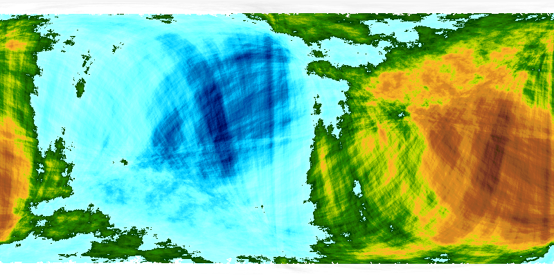
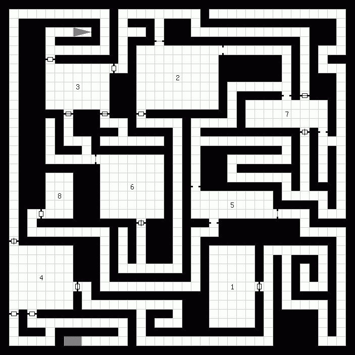

Originally from http://donjon.bin.sh/code/ , ©2009-2015 "drow"

Four separate tools: A name generator, a random generator, a fractal world generator and a random dungeon generator.

#Name Generator
##How it Works

This name generator constructs and uses [Markov chains](http://en.wikipedia.org/wiki/Markov_chain). Given a list of sample names, it analyzes each name to construct frequency tables for name length and letter pairs. It then uses these tables to construct a new name in the style of the sample set.

##Source Code

The following source code provides a JavaScript random name generator, and some example data. The name generator is released to the public domain. The example data is drawn from Kate Monk's Onomastikon, © 1997 Kate Monk.

* [name_generator.js](namegenerator/name_generator.js)
* [egyptian_set.js](namegenerator/egyption_set.js)

##Using the Generator

First, you'll need to create a JavaScript data file. This file defines an array list of sample names as a named element of the name_set object (which is declared in name_generator.js).

Then, include both the name_generator.js file and your data file in your HTML page. A clever person might note that you could easily create and include more than one data file here.

```html
<script type="text/javascript" src="name_generator.js"></script>
<script type="text/javascript" src="egyptian_set.js"></script>
```

The generate_name() function accepts a single argument, the name of your name set, and returns a text string. You can simply write this text string to the HTML page...

```html
<script type="text/javascript">
  document.write(generate_name('egyptian'));
</script>
```

> Nerkho

Or assign it to a variable in your own JavaScript code. You may also be interested in the name_list() function, which accepts the name of a name set and a number, and returns an array of generated names.
##tl;dr

* [name.html](namegenerator/name.html)

#Random Generator

##Source Code

The following source code provides a simple yet flexible JavaScript random text generator, and some example data. Both are released to the public domain.

* [generator.js](randomgenerator/generator.js)
* [warrior_data.js](randomgenerator/warrior_data.js)

##Using the Generator

First, you'll need to create a JavaScript data file. This file defines tables as named elements of the gen_data object (which is declared in generator.js). Typically, the first or main table in the file contains text patterns, which may include phrases or words from other tables indicated by {name}. Note that table names can only contain the letters a-z, digits 0-9, and the underscore. A table may be defined as a simple array list, or as a indexed object (see the warrior_data.js file for examples of both).

Then, include both the generator.js file and your data file in your HTML page. A clever person might note that you could easily create and include more than one data file here.

```html
<script type="text/javascript" src="generator.js"></script>
<script type="text/javascript" src="warrior_data.js"></script>
```
The generate_text() function accepts a single argument, the name of your main table, and returns a text string. You can simply write this text string to the HTML page...

```html
<script type="text/javascript">
  document.write(generate_text('warrior'));
</script>
```

A female human warrior, wearing plate armor and wielding a longbow and arrows.

Or assign it to a variable in your own JavaScript code. You may also be interested in the generate_list() function, which accepts the name of a table and a number, and returns an array of generated text strings.
##tl;dr

* [random.html](randomgenerator/random.html)

#Fractal World Generator
##A Brief History

The fractal world generator is based on code by [John Olsson](http://www.lysator.liu.se/~johol/fwmg/fwmg.html). The donjon version was completely rewritten in Nov 2009, and includes changes to the faulting algorithm and support for alternate color palettes. It also supports additional map projections; icosahedral was added in Sept 2010, and sinusoidal, Mollweide, and transverse Mercator in Aug 2011.
##How it Works

A sphere is bisected along a random great circle, and one half elevated above the other. Repeating this process thousands of times produces a faulted terrain. Next, the elevation values are sorted into a histogram to determine sea level. Finally, the elevation map is scaled into a color map, and transformed into the desired projection.
##Source Code

The original code has a few minor errors which can cause a segmentation fault and crash. Version 2.2a linked below fixes these problems. Both versions are provided under the [GNU General Public License, version 2](https://www.gnu.org/licenses/old-licenses/gpl-2.0.txt).

    worldgen 2.2, by John Olsson
    worldgen 2.2a, fixed

##The World of Tumult



#Random Dungeon Generator
##A Brief History

I began work on my dungeon generator sometime around 1999. It was originally hosted on the demonweb (my personal home page), moved to the Dire Press website in May 2006, and then to the donjon website in Sept 2009. Early versions included basic dungeon layout and size options, and generated maps as HTML tables of black and white cells. Code to generate images for dungeon maps was added in March 2009, and for cavernous dungeons in Sept 2010.
How it Works

A dungeon is constructed as a two-dimensional matrix of integers, each representing one cell. Within an integer, each bit indicates a different state, such as 0x01 for blocked cells, 0x02 for cells in rooms, and 0x04 for cells in corridors. Rooms and corridors always fall along odd-numbered columns and rows, and rooms are always odd numbers in width and height.

Rooms are placed randomly or by algorithm. If a room does not collide with a blocked cell, another room, etc. then the room and its perimeter are marked out in the matrix. Next, the generator calculates a reasonable number of entrances based on the room size, and attempts to open that number of entrances in the room perimeter.

The corridor generator is a simple recursive algorithm with a few quirks. Labyrinth corridors are generated by shuffling the list of directions randomly, errant corridors continue in the current direction 50% of the time, and straight corridors continue 90% of the time.

Caverns are generated using cellular automata, inspired by [Jim Babcock's article at RogueBasin](http://roguebasin.roguelikedevelopment.org/index.php?title=Cellular_Automata_Method_for_Generating_Random_Cave-Like_Levels). If the algorithm results in multiple cavern systems, a simple search finds the shortest cuts required to join them. The cavern is refined from cell to display resolution by iteratively dividing each cell into smaller cells and re-running the cellular automata algoritm.
##Source Code

The following source code is a simplified implementation of the donjon random dungeon generator. It is provided under the [Creative Commons Attribution-NonCommercial 3.0 Unported License](http://creativecommons.org/licenses/by-nc/3.0/).

    [dungeon.pl](dungeon/dungeon.pl)

##The Dungeon of Random Death



